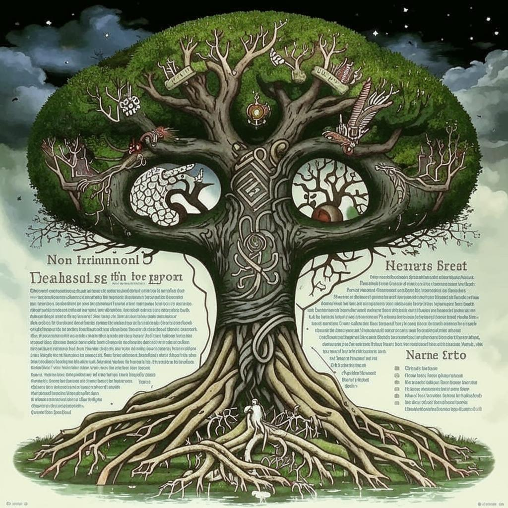

<p align="center"></p>

<h1 align="center">Yggdrasil API</h1>
<p align="center">
<b>Yggdrasil API</b> 
- miniature api written in Go using Fiber for running your own blog
</p>

---

# Run
## Makefile
### Run
```bash
make run
```
### Run air

```bash
make air_w
```
### Build

```bash
make 
```

# Stack
- fiber
- slug
- sqlite

# Functionality
- site search
- filtering by tags
- reading articles
- reading obsidian storage
- pagination
